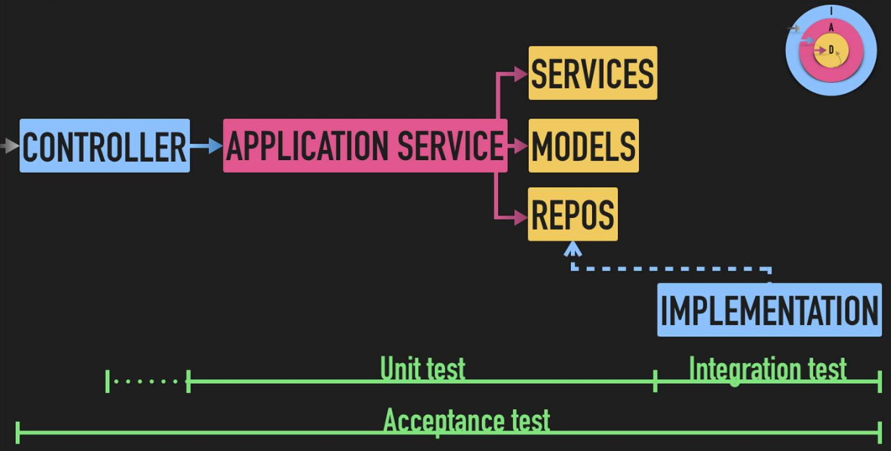

# Python API example (SOLID & Hexagonal Arch.)


## Overview

Example of an API built with Python3, followin Hexagonal architecture (*ports & adapters*) and SOLID principles.  
It uses some well known packages as Flask and SQLAlchemy.

Available endpoints:

 - `/acquire/pdf`
    - input: PDF file, by `POST`, as *form-data*. Expected POST param name is: `file`.
    - output: JSON like `{"plain_text": "All plain text extracted from PDF file"}`.

 - `/anonymize/txt`
    - input: txt plain text file, by `POST`, as *form-data*. Expected POST param name is: `file`. See an example of file structure on [this sample file](samples/sample_report.txt).
    - output: JSON like `{"patient_id": "1234", "document_text": "She's in good health!"}`.


## Installation

### Requirements

Install [docker](https://docs.docker.com/install/linux/docker-ce/ubuntu/), and [docker-compose](https://docs.docker.com/compose/install/).

### Setup

Clone this repo and build Docker containers with docker-compose


```
git@github.com:serfer2/flask-hexagonal-architecture-api.git
cd flask-hexagonal-architecture-api
docker-compose up -d
```

## Architecture

Code architecture follows hexagonal architecture principles, also known as *ports and adapters*.

This architecture is divided in three main layers:

- **Infrastructure**:  The outer layer. Controllers and all I/O related stuff (web framework, DB, ...). Anything that can change by an "external" cause (not by your decision), is in this layer. It includes repositories specific implementation, known as *adapters*.

- **Application**: Use cases. Actions triggered by API calls, represented by application services.

- **Domain**: Inner layer. Business context and rules goes here, represented by models and domain services. Repositories Interfaces, known as *ports*, belongs to this layer.




### Code structure

Code source tree looks like this:

```
.
├── application
│   ├── exceptions.py
│   ├── __init__.py
│   └── services
│       ├── acquire_pdf_file.py
│       ├── anonymize_txt_file.py
│       └── __init__.py
├── controller
│   ├── app.py ---------------> API entry point
│   ├── exceptions.py
│   ├── __init__.py
│   └── utils.py
├── Dockerfile
├── domain
│   ├── __init__.py
│   ├── models
│   │   ├── __init__.py
│   │   └── report.py
│   └── repositories
│       ├── __init__.py
│       └── report_repository_interface.py
├── infrastructure
│   ├── database.py
│   ├── __init__.py
│   └── repositories
│       ├── base_repository.py
│       ├── __init__.py
│       └── report_repository.py
├── lint.sh
├── requirements.txt
└── test
    ├── application
    │   ├── __init__.py
    │   └── test_services.py
    ├── base_test_case.py
    ├── controller
    │   ├── __init__.py
    │   └── test_app.py
    ├── infrastructure
    │   ├── __init__.py
    │   └── test_repositories.py
    └── __init__.py
```

## Testing


### Running tests

Tests have been built with [Unittest](https://docs.python.org/3/library/unittest.html). Running tests is as simple as:

```
docker-compose exec api python -m unittest discover
```

### Testing strategy

 - We're testing full API call lifetime cycle, see `test/controller/test_app.py`. These tests are not **acceptance** tests but close to be.

 - Application services have been tested trough `test/controller/test_app.py`, but some extra **unit** tests have been needed, these tests are in `test/application/test__services.py`.

 - Since API is very simple, we don't have *domain services*. *Models* are close to be *DTOs*, so there's no logic to be tested. This is why there's no `test/domain/` folder.

 - According to the architecture schema (see image above), **integration** tests are in `test/infrastructure/test_repositories.py`.

## References

 - [ES] Curso de arquitectura Hexagonal de [codely.tv](https://pro.codely.tv/library/arquitectura-hexagonal/66748/about/)
 - [Flask](https://flask.palletsprojects.com/en/1.1.x/) development guide.
 - [SQLAlchemy](https://docs.sqlalchemy.org/en/13/) documentation.


## ToDo:

Since this is a demo project, extracting plain text from PDF, is out of scope. This is why `AcquirePdfFile` application service is incomplete (actually returning a hardcoded string). Feel free to complete it :)

